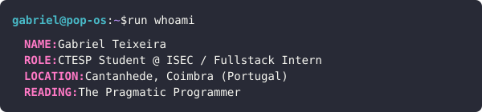
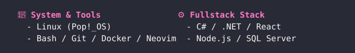
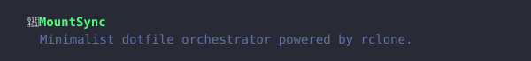

# 

  
  
  

 

 

  

 

 

 

  &nbsp;&nbsp;

 

 
<table width="100%" style="background: #282a36; border-radius: 0 0 8px 8px; margin-top: -1px;">
<tr>
<td align="center" width="50%">

</td>
<td align="center" width="50%">

</td>
</tr>
</table>

 

  

    
  

 

 

